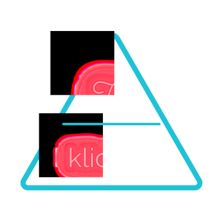

<h1 align="center">
  
  Hello World
	
	 
	Welcome to my github
<h1>

</img>

<h2 align="center">I'm Carlos Usuga Martinez</h2>
 

	I am a passionate and creative Software Developer from Colombia
	 
	 
	A person with the ability to learn fast thanks to my discipline, curious and a person who likes to be constantly learning, so in my free time I like to work on parallel projects and try to keep learning new things to improve my skills.

 

 

<h3 align="center">
	<b>Languages and Tools:</b>
</h3>

 

	<code>
	</code>
	<code></code>
	<code>
		
	</code>
  <code>
		
	</code>
	 
	<code>
		
	</code>
  <code>
		
	</code>
	<code>
		
	</code>
	<code>
		
	</code>
	 
	<code>
		
	</code>
	<code>
		
	</code>
	<code>
		
	</code>
  <code>
		
	</code>
   
	<code>
		
	</code>
	<code>
		
	</code>
	<code>
		
	</code>
  <code>
		
	</code>

 

 
<h3 align="center">
	<b>You can find me on:</b>
</h3>
 

 

 

	
		 
		 
		

 

	</img>

